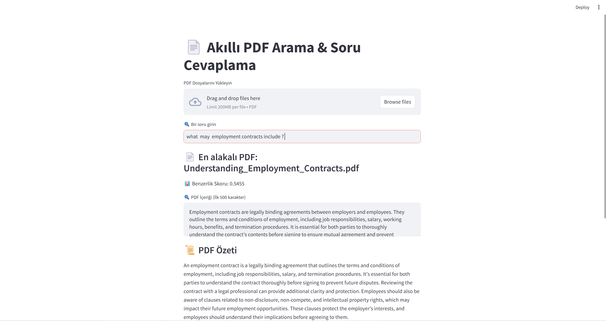
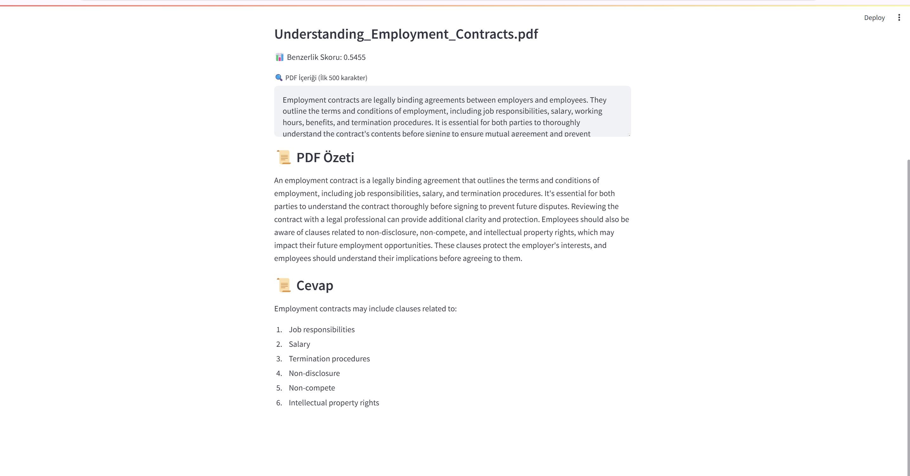

# Information_Retrieval using Bert and Llama3 

## 📄 Akıllı PDF Arama & Soru Cevaplama

Bu proje, PDF dosyalarını analiz eden, en alakalı belgelere ulaşmanı sağlayan ve sorularınıza yapay zeka ile yanıt veren bir Streamlit uygulamasıdır.

🚀 Özellikler

- PDF dosyalarını yükleyerek içeriğini otomatik olarak analiz eder.

- Kullanıcının sorduğu soruya en alakalı PDF'i bulur.

- BERT tabanlı vektörleştirme ile belgelere benzerlik skoru hesaplar.

- Groq API (Llama3-70B) kullanarak özetleme ve soru cevaplama yapar.

## 📥 Kurulum

- Gerekli Python kütüphanelerini yükleyin:

- pip install streamlit pymupdf transformers torch numpy scikit-learn groq

- API anahtarınızı key.py dosyasına ekleyin:

- api_key = "YOUR_GROQ_API_KEY"

## 📌 Kullanım

- Uygulamayı başlatın:

    - streamlit run app.py

    - PDF dosyalarınızı yükleyin.

    - Soru sorun ve en alakalı PDF'in seçilmesini bekleyin.

    - Groq AI özetleme ve cevapları görebilirsiniz!

## 🛠 Çalışma Prensibi

- PDF dosyaları yüklenir ve metin içerikleri çıkarılır.

- Kullanıcının sorusu, BERT kullanılarak vektörleştirilir.

- Tüm PDF içerikleriyle benzerlik skoru hesaplanır.

- En alakalı PDF seçilir ve içeriği özetlenir.

- Soruya en uygun yanıt, Llama3-70B modeli ile üretilir.

💡 Herhangi bir hata alırsanız, API anahtarınızı kontrol edin ve bağımlılıkların yüklü olduğundan emin olun.

